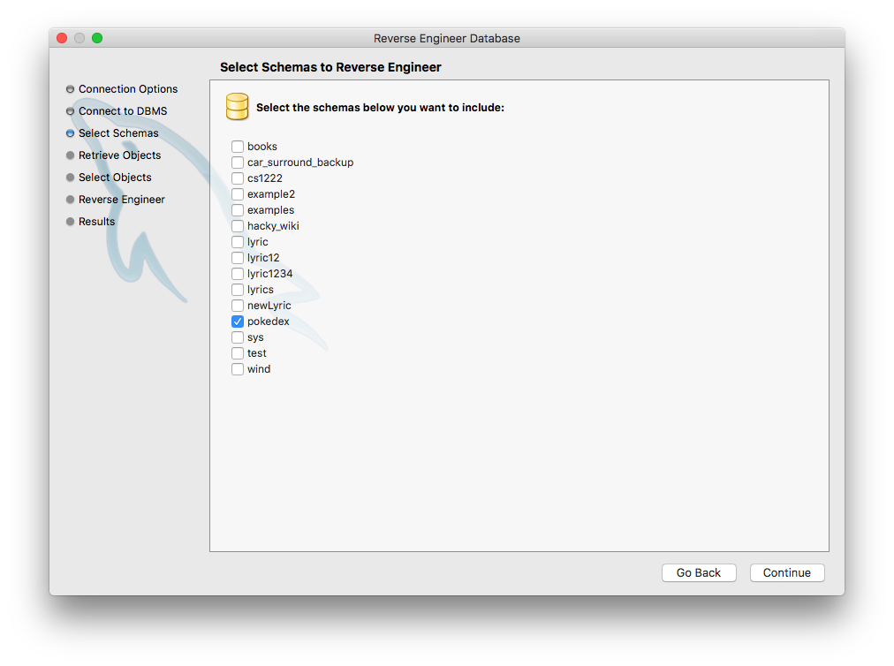

# Excra Credit

In extra credit, you will be using pokedex.sql from samples. Please import them before starting extra credit.

> Hint: before you start you might want to look at all tables with their relationship first. To do so, you can follow the following procedure.

> There are a couple steps missing above but you can simply click on `continue` on all other steps.

With relationship graph you generated from above steps, it should help you to answer the following questions.

Qeustions:

1. Find pokemon name and their ability names in the following form
    pokemon_identifier, ability_identifier
2. Find pokemon id 25 with its stats (including name and base_stat)
    stat_name, base_stat
3. Find all pokemons (including name) that require item to evolve (evolution!)
    pokemon_identifier, item_name
4. Find all `generation-v` pokemons
    geration_identifier, pokemon_identifier
5. Find all pokemon belong to egg_group `fairy`
    pokemon_identifier