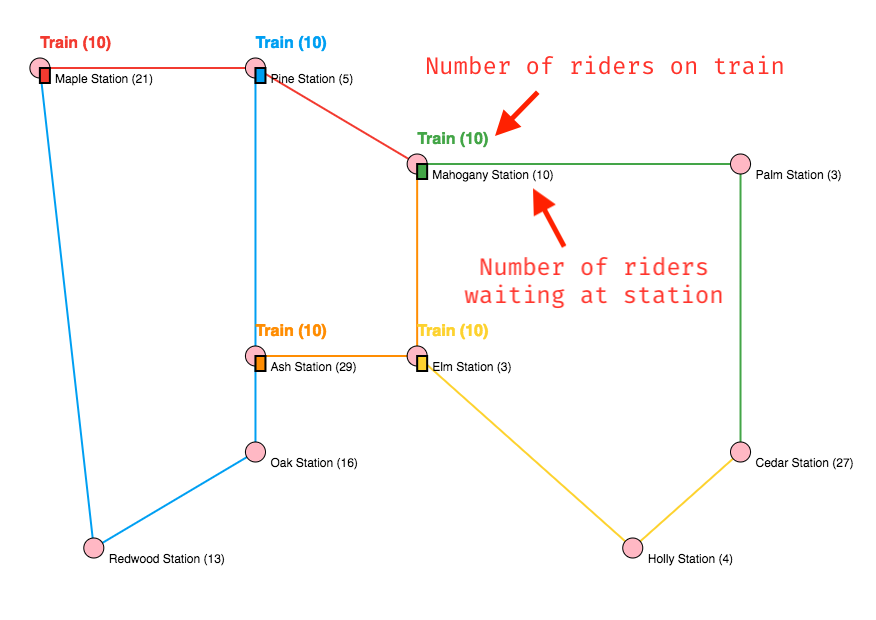

# Extra Credit

In this year, we are experimenting with data science topic in this intro level
course in hope of raising students' interests to Computer Science.

We will start by explaining what is *data science* and especially what part of
data science we are doing in this extra credit – data analytics.

From there, it leads to the extra credit requirements – aggregating data
to answer questions and using these queries to lead actionable items.

## Data Science

Data Science is trending in last few years and it creates a lot of opportunities
to business. It can be simplified into 4 steps:

1. Data collection
2. Data storage
3. Data analytics
4. Data visualization

In data collection, a data scientist needs to collect data from various sources
of inputs from IoT (internet of things), Google Analytics, Kafka (unified log
storage) to databases (MySQL, Oracle, MongoDB … etc.). From these source of
data, data scientist usually replicate the data into other storage in the favor
of processing as well as the reason of not affecting the production performance
in business.

As mentioned earlier, the data scientist needs to decide what storage to use to
store data coming from the *data collection* above. There are many different
choices here based on the data size and the processing needs. These goes from
traditional database like MySQL, MongoDB to distributed file storage like Hadoop
or even recently ElasticSearch.

In the spirit of this course, we will be picking MySQL and MongoDB. In industry,
you may or may not necessary be using any of these. In fact, you may not be using
either of it and needs to learn more data storage options in future.

After storing into the data storage, you will then need to *analyze* the data
and start to *create a story* around the data you get. This usually involves
data aggregation on huge set of data. In example, you may try to find number
of items to begin with. From there, you might want to do some simple math
stats. Once you collect some numbers, you will start by reasoning behind the
data and come up with the story to present such data.

Optionally, some data scientists may also focus on applying Machine Learning
algorithm to help processing data and create a better story. This is quite
advance to discuss here so we will skip the discussion on this area.

After analyzing the data, the data scientist will usually need to present the
finding through graph or some other sort of visualization. This usually involve
using charting libraries. Since we are on the intro level course, we will not
go over too much of detail here. You can think of simplest format of presenting
by copying the number from the data analytic process into an Excel spreadsheet
to present the graph.

In summary, data science is about data pipeline going from collecting, storage,
analyzing to visualization. The goal is to create a story around the data so that
business can take action with confident!

## Extra Credit Requirements

Now, what you need to do is – analyze the pattern of metro trains. We will
provide you a MySQL database read access with a tons of data and continue growing
data over the entire time.

To start with, you can see the simple visualization of current metro state here:
http://138.68.57.231:8000/



You can find the number of riders and how train moves visually.

### The requirements

Your job here is to look at the data in MySQL table using the following credential:

```
host:
138.68.57.231

user:
cs1222students

password:
cs1222password

database:
metro
```

There should only be one table there. You can take a look now to start answering
following questions

1. Which station is the most busiest station?
    * The station with highest amount of riders showing up at station
2. Which line generates most profit? Overall, how much profit does each line generate?
    * Use the `ticket_price` table in conjunction with `rider_events` to answer question above
3. When is the rush hour? (work hour as the hours riders shows up at station more)
    * Find three hours continually that has highest amount of rider showing up (e.g. 8 - 11, 9 - 12 … etc.)
4. Find 3 dates that has highest amount of riders.
5. Which line has most rider leaving because they cant get onto train?

As hint, here is the table definition:

```sql
CREATE TABLE IF NOT EXISTS rider_events (
    action varchar(50) NOT NULL,
    station varchar(50) NOT NULL,
    line varchar(50) NOT NULL,
    timestamp timestamp DEFAULT CURRENT_TIMESTAMP
);

CREATE TABLE IF NOT EXISTS line_tickets (
    line varchar(50) NOT NULL PRIMARY KEY,
    ticket_price float NOT NULL DEFAULT 1.99
);
```

`action` indicates what event happens. It can be any of the following:

* RIDER_ARRIVAL_STATION
    * Riders come to station (paid ticket and waiting)
* TRAIN_FULL
    * Riders cant get onto train because train is full. They have to wait for next arrival.
* RIDER_ARRIVAL_TRAIN
    * Riders go onto train.
* RIDER_LEAVE_STATION
    * Riders leave station because of long wait.
* RIDER_DEPARTURE_TRAIN
    * Riders arrive their destination and leave train.

After answering above question, the next question is a bit non-trivial but leads to
real world scenario. Which line should have more trains on it if so, how many
more train should be added? Use the above query to support your statement.
