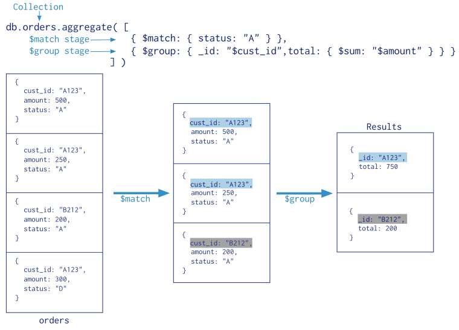

## MongoDB Aggregation

Last week, we learned how to do CRUD(Create, Read, Update & Delete) operations in MongoDB. This is usually sufficient enough for you to start using MongoDB. Nevertheless, there are more that MongoDB can do, specifically on the area of data aggregation. Aggregations are very interesting from the data scientists' point of view because it allows data scientists to be able to simplify big data into metrics.

In example, I, as a software engineer, often got asked by product managers to get some metrics about certain projects like how many users used the new feature since the launch. This kind of data often requires doing data aggregation operations to report a metric.

All in all, we will be learning how to do data aggregation and report a metric from MongoDB in this lesson!

### What are aggregations?

From the MongoDB documentation:

> Aggregations operations process data records and return computed results. Aggregation operations group values from multiple documents together, and can perform variety of operations on the grouped data to return a single result.  
> Reference: [https://docs.mongodb.com/manual/aggregation/](https://docs.mongodb.com/manual/aggregation/)

In short, aggregations operations allow developers to look at the massive data in a simpler way. For example, counting how many students are in the students table. In other word, aggregations allow developers to look at the data from different angles.

### Recap on SQL Group By

As a recap, we have learned how to use group by earlier in MySQL to do some aggregation such as counting number of rows with group by.

```sql
SELECT ArtistID, COUNT(*) FROM Artists
INNER JOIN Titles
ON Artists.ArtistID = Titles.ArtistID
GROUP BY ArtistID;
```

Consider above query, we are counting number of titles published by artist.

You can review the notes under https://github.com/csula/cs1222-fall-2016/blob/master/notes/sql-aggregation.md

### MongoDB Review

Remember that you can do READ operation like below:

```js
db.collection.find();

// use pretty to print pretty
db.colleciton.find().pretty();

// simplest format of aggregation
// use count to count number
db.collection.find().count();
```

In addition to just reading the document as it is, you might find it to be helpful to just display some of the fields. This operation is called **projection**. 

You can do projection like below:

```js
db.collection.find( <query filter>, <projection> )
```

You can find out more about MongoDB query in [this API documentation](https://docs.mongodb.com/manual/reference/operator/query/).

Although there are three different types of aggregations, we will only cover the pipeline aggregations here. If you want to learn out more for your own goods. Check MongoDB official documentation.

### Aggregation pipeline



Aggregation pipeline separates out the data aggregation processing into a few pipelines (or stages). In graph above, we noticed that it briefly separated into **$match** and **group** pipelines. 

> Aggregation pipelines are not limited to just "$match" and "$group" and there are more. See [pipeline operations here](https://docs.mongodb.com/manual/reference/operator/aggregation/#aggregation-pipeline-operator-reference)

In MongoDb, you can simply call `db.collection.aggregate()` method in the mongo shell.

#### Learn by example

In the following section, we will follow the example using the zip code data set. Please download [http://media.mongodb.org/zips.json](http://media.mongodb.org/zips.json) to your download directory and import the JSON to your mongo database.

> Reminder: to import a JSON, please use `mongoimport` command

Each document in the `zipcodes` collection has the following form:

```json
{
	"_id": "10280",
	"city": "NEW YORK",
	"state": "NY",
	"pop": 5574,
	"loc": [
		-74.016323,
		40.710537
	]
}
```

##### Return states with Populations above 10 Million

```js
db.zipcodes.aggregate( [
	{ $group: { _id: "$state", totalPop: { $sum: "$pop" } } },
	{ $match: { totalPop: { $gte: 10 * 1000 * 1000 } } }
] )
```

In code above, the aggregation pipeline has two stages ($group followed by $match)

The $group stage groups the documents by the state field, calculate the `totalPop` by the sam of population.

In $group stage, `_id` field is required and will be used to accumulate values. In example, we are using "state" field to group data.

Other fields presented in the $group object will be used as accumulators. In example, we accumulate the sum of population by `pop` field.

There are a few other accumulator operator you may use like below:

| Name | Description |
|:--|:--|
| $sum | return a sum of numerical values. Ignore non-numeric values. |
| $avg | returns an average of numerical values. Ignore non-numeric values. |
| $first | returns a value from the first document for each group. Order is only defined if the documents are in a defined order. |
| $last | similar to above but returns last document. |
| $max | returns the highest expression value for each group. |
| $min | similar to above but returns the lowest |
| $push | return an array of expression values for each group. |
| $addToSet | returns an array of unique expression values for each group |
| $stdDevPop | returns the population standard deviation of the input values. |
| $stdDevSamp | returns the sample standard deviation of the input values. |

The $match stage filters these grouped documents to output only those documents whose totalPop is greater than 10 million.

The equivalent SQL would be:

```sql
SELECT state, SUM(pop) AS totalPop
FROM zipcodes
GROUP BY state
HAVING totalPop >= (10 * 1000 * 1000); 
```

#### Return average city population by state

```js
db.zipcodes.aggregate( [
	{ $group: { _id: { state: "$state", city: "$city" }, pop: { $sum: "$pop" } } },
	{ $group: { _id: "$_id.state", avgCityPop: { $avg: "$pop" } } }
] )
```

In this example, aggregation pipeline consists of two $group stages.

The first $group stage groups the documents by the combination of city and state. And uses $sum to calculate the total population for each combination.

The output documents looks like below:

```json
{
	"_id": {
		"state": "CO",
		"city": "EDGEWATER"
	},
	"pop": 13154
}
```

And then second $group stage groups the documents by `_id.state` field (e.g. `state` field) and uses $avg expression to calculate the average city population for each state.

#### Return largest and smallest cities by state

```js
db.zipcodes.aggregate( [
   { $group:
      {
        _id: { state: "$state", city: "$city" },
        pop: { $sum: "$pop" }
      }
   },
   { $sort: { pop: 1 } },
   { $group:
      {
        _id : "$_id.state",
        biggestCity:  { $last: "$_id.city" },
        biggestPop:   { $last: "$pop" },
        smallestCity: { $first: "$_id.city" },
        smallestPop:  { $first: "$pop" }
      }
   },

  // the following $project is optional, and
  // modifies the output format.

  { $project:
    { _id: 0,
      state: "$_id",
      biggestCity:  { name: "$biggestCity",  pop: "$biggestPop" },
      smallestCity: { name: "$smallestCity", pop: "$smallestPop" }
    }
  }
] )
```

In this example, the aggregation pipeline has a $group stage, a $sort stage, another $group and then a $project stage.

The first $group stage groups documents by combination of the city and state and calculate the sum of the population.

The $sort stage orders the documents by the pop field value from smallest to largest.

The second $group stage groups the new sorted documents by the `_id.state` field and outputs a document for each state.

Last $project stage rename _id field to state and moves the biggestCity, biggestPop, smallestCity and smallestPop into biggestCity and smallestCity embedded documents.

### References:

* [SQL aggregation to MongoDB aggregation comparison](https://docs.mongodb.com/manual/reference/sql-aggregation-comparison/)
* [Aggregation pipeline API documentation](https://docs.mongodb.com/manual/reference/operator/aggregation/)
