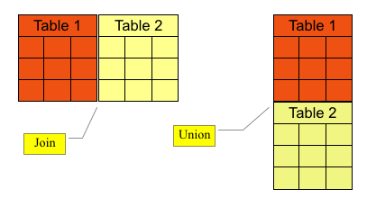

# Advanced Queries

## Objectives

* Learn to create queries with UNION and UNION ALL
* Learn to create INTERSECT and MINUS queries
* Use Sub-Queries in the SELECT clause
* Create Correlated Sub-Queries
* Use Exists with Sub-Queries
* Write nested Sub-Queries

### SQL Execution Plan

```sql
SELECT {column(s)}, {AGGREGATE_FUNCTION(colum(s))} # 8
FROM {table(s)} # 1
  {LEFT | RIGHT | INNER } JOIN {table2} # 2
  ON {table1.column = table2.column} # 3
WHERE {condition(s)} # 4
GROUP BY {column(s)} # 5
HAVING {condition(s)} # 6
ORDER BY {column(s)}; # 7
```

### Joins vs Unions



### Union

Syntax:

```sql
SELECT {column(s)}
FROM {table1}
UNION [ALL]
SELECT {column(s)}
FROM {table2}
ORDER BY {column(s)}
```

Example:

```sql
# List all studios and members who are the responsible party for an artist,
# identifying the source as S or M.
SELECT 'M' AS Src, FirstName, LastName, Address, City, Region, PostalCode
FROM Members M
  INNER JOIN XRefArtistsMembers X ON M.MemberID = X.MemberID
WHERE RespParty = 1
UNION
SELECT 'S', StudioName, ' ', Address, City, Region, PostalCode
FROM Studios;
```

### Union Rules

* Must have same number of fields
* Must have same data types in corresponding fields
  * Or data types can be implicitly converted
* Corresponding fields do not need to have the same names
  * Field names from first query will be used in the result table
* Place ORDER BY clause last using column names from the first query

### Union vs. Union All

Union all contains duplicates and union doesn't.

### Using Union to report both detail and total

```sql
SELECT TrackNum, TrackTitle, LengthSeconds
FROM Tracks
UNION
SELECT 99, # using 99 to fill column and allow proper sorting
'Total', SUM(LengthSeconds)
FROM Tracks
ORDER BY TrackNum;
```

### Using Union to report multiple summary statistics

```sql
SELECT 1, '< 2 minutes' AS Length, COUNT(*) AS NumTracks
FROM Tracks
WHERE LengthSeconds < 240
UNION
SELECT 2, '2-3 minutes', COUNT(*)
FROM Tracks
WHERE LengthSeconds BETWEEN 240 and 360
UNION
SELECT 3, '> 3 minutes', COUNT(*)
FROM Tracks
WHERE LengthSeconds > 360;
```

### Using Union to treat multiple columns as one

```sql
SELECT COUNT(SoundFile) AS Num_Electronic_Files
FROM (
  SELECT MP3 AS SoundFile
  FROM Tracks
  WHERE MP3 = 1
  UNION
  SELECT RealAud
  FROM Tracks
  WHERE RealAud = 1
) UnionQuery; # some database may require you to have allias
```

### Cautions on union overuse

* Overuse can indicate poorly-designed data
* Union generally run much slower than joins
  * For joins, the database can generally take advantage of indexes on primary  
  and foreign keys
  * But a union (especially without All option) has to compare all columns from  
  every select

### Intersect

Reports rows that exist in both of two tables or sub-queries.

Syntax:

```sql
SELECT {column(s)}
FROM {table1}
INTERSECT
SELECT {column(s)}
FROM {table2};

# mysql syntax
SELECT DISTINCT {column(s)}
FROM {table1}
INNER JOIN {table2}
USING ({column(s)})
```

Example:

```sql
SELECT DISTINCT City, Region
FROM Members
INNER JOIN Artists
USING (City, Region);
```

### Minus

Reports rows in one recordset except that match rows in second recordset.

Syntax:

```sql
# not exist in mysql
SELECT {column(s)} FROM {table1}
MINUS
SELECT {column(s)} FROM {table2};

# MySQL
SELECT a.x, a.y
FROM table_a a LEFT JOIN table_b b
ON a.x = b.x AND a.y = b.y
WHERE b.x IS NULL;
```

Example:

```sql
SELECT g.Genre
FROM Genre g
LEFT JOIN Titles t ON g.Genre = t.Genre
WHERE t.Genre IS NULL;
```

### Sub-Queries in SELECT Clause

Syntax:

```sql
SELECT {column(s)}, (
  SELECT {column(s)}
  FROM {table}
)
FROM {table};
```

Example:

```sql
# list track title, length in seconds, and the total seconds for the entire CD
# for all tracks in TitleID 4
SELECT TrackTitle, LengthSeconds, (
  SELECT SUM(LengthSeconds) FROM Tracks
  WHERE TitleID = 4
) AS TotSec
FROM Tracks
WHERE TitleID = 4;

# list track title, length in seconds, and the length as a percentage of the
# total time for the CD for all tracks in TitleID 4.
SELECT TrackTitle, LengthSeconds, CAST(CAST(LengthSeconds AS DECIMAL(5, 2)) / (
  SELECT SUM(LengthSeconds) FROM Tracks
  WHERE TitleID=4
) * 100 AS DECIMAL(5, 2)) AS PctTime
FROM Tracks
WHERE TitleID = 4;
```

### Correlated Sub-Queries

* Sub-query returns multiple rows without a GROUP BY and a non-aggregate in SELECT
* Refers in the sub-query to T table alias that exists only in the outer query
* Because of unique syntax the sub-query cannot be debugged as independent query

```sql
SELECT TrackTitle, LengthSeconds AS Sec, (
  SELECT SUM(LengthSeconds) FROM Tracks SC
  WHERE SC.TitleID = T.TitleID
) AS TotSec
FROM Tracks T
WHERE TrackNum = 1;
```

Syntax:

```sql
SELECT {column(s)}, (
  SELECT {column(s)}
  FROM {Table2}
  WHERE Table2.Column = Table1.Column
)
FROM Table1;
```

Example:

```sql
# For the first track on each title, list the track title, length in seconds,
# total length for that title, and the length as a percentage of the total time
# for that title.
SELECT
  TrackTitle,
  LengthSeconds,
  (
    SELECT SUM(LengthSeconds) FROM Tracks SC
    WHERE SC.TitleID = T.TitleID
  ) AS TotSec,
  CAST(CAST(LengthSeconds AS Decimal(5, 2)) / (
    SELECT SUM(LengthSeconds) FROM Tracks SC
    WHERE SC.TitleID = T.TitleID
  ) * 100 AS Decimal(5, 2)) AS PctTime
FROM Tracks T
WHERE TrackNum = 1;
```

### Exists with Sub-Queries

* EXISTS checks for the existence of data in the sub-query
* Data is either there (TRUE) or it isn't (FALSE)
* Often used as a WHERE clause sub-query but with correlated sub-query syntax

Example:

```sql
SELECT ArtistName
FROM Artists A
WHERE EXISTS
(
  SELECT ArtistID, COUNT(MemberID)
  FROM XRefArtistsMembers X
  WHERE X.ArtistID = A.ArtistID
  GROUP BY ArtistID
  HAVING COUNT(MemberID) > 1
);

# sub-query returns one or more rows which are correlated with rows of outer query
# if any matching sub-query rows are found, row from outer query is reported
```

Syntax:

```sql
SELECT {column(s)}
FROM {table1}
WHERE EXISTS (
  SELECT {column(s)}
  FROM {table2}
  WHERE table1.column = table2.column
);
```

Example:

```sql
# List the names of all artists who have recorded a title.
SELECT ArtistName
FROM Artists
WHERE EXISTS (
  SELECT ArtistID
  FROM Titles T
  WHERE T.ArtistID = A.ArtistID
);
```

### Correlated Sub-Queries vs. Joins

```sql
# correlated sub-query
SELECT ArtistName
FROM Artists A
WHERE EXISTS (
  SELECT ArtistID, COUNT(MemberID)
  FROM XRefArtistsMembers X
  WHERE X.ArtistID = A.ArtistID
  GROUP BY ArtistID
  HAVING COUNT(MemberID) > 1
);

# Join
SELECT ArtistName
FROM Artists A
INNER JOIN (
  SELECT ArtistID, COUNT(MemberID) AS NumMember
  FROM XRefArtistsMembers
  GROUP BY ArtistID
  HAVING COUNT(MemberID) > 1
) SQ
ON A.ArtistID = SQ.ArtistID;
```

* Join is easier to write, read and maintain

### Nested sub-queries

* SQL allows nesting sub-queries within sub-queries
* Number of levels allowed is not so important
  * You will get confused before SQL does

```sql
SELECT ArtistName
FROM Artists A WHERE EXISTS
(
  SELECT ArtistID
  FROM Titles T
  WHERE T.ArtistID= A.ArtistID
  AND EXISTS
  (
    SELECT TitleID, COUNT(TrackNum)
    FROM Tracks TR
    WHERE TR.TitleID = T.TitleID
    GROUP BY TitleID
    HAVING COUNT(Tracknum)>=10
  )
);
```
