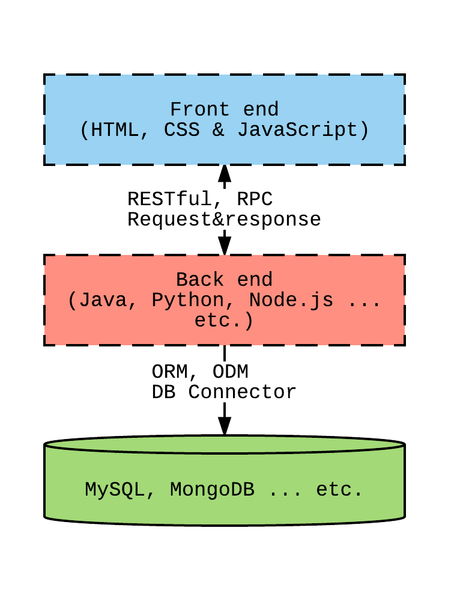

# Intro to Database Summary

In this last lesson, we will go over the practical sense of the database in the modern web development world. In other word, we will be looking at a web application in regards of how the database knowledge will be used. 

## Recap

What have we learned so far?

* MySQL CRUD
* MySQL Aggregations
* MySQL Joins (most challenged one)
* MySQL Transactions
* MongoDB CRUD
* MongoDB Aggregations

CRUD operations are easily accomplishable from the above skills and you should all be able to do it now (including setting up a database on your own local environment -- laptop).

## Expectations

Specifically, you should be able to do the followings:

You should be able to create a DDL file (data definition language) like what we have in samples to create database and tables.

You should be able to read data from the DDL file you created above and mutate the data in the database (including create, update and delete).

With above expectations, you are now able to persist data into database!

## Aggregations

What about aggregations?

Aggregation operations are like special type of read that gives developers a way to group and simplify data out of database.

As I mentioned earlier in class, aggregations are commonly used to answer some data science questions such as counting, doing statistics on the data & other goodies.

## Webapp architecture

In the beginning of the class I presented the following basic architecture of the web application:

In almost most cases, the modern web app starts with these three components -- front end, back end and database.

Front end presents the view layer to end users. It consists of the UI (user interface) and the user interactions to interact with your **data models**.

From Front end, your client application (sometimes called front end applications) will be sending *requests* to your server (back end).

Back end contains your business logics (validation, authentication, and logic related to business domain). Usually business domain logic is being contained in, what I called, data models. For example, user model contain username, password, age, id and so on; in addition to the user models, I might also have a class model to contain a class information.

With the data models from the back end, database is to store those data models in most efficient way. Moreover, database is considered to be a single truth of the business. In other word, all software business now relies a lot on the database!

What we have learned so far is only within the database layer. And this is not enough to build a stand along application just yet.

However, in this lesson, I'll give an overview on what a stand along application would look like.

## Webapp example

The simplest web app we can build today would be built from Node.js because there are a lot of modules online we can reuse already!

Without further due, we will dive into code example:

## Final thoughts

Lastly, I hope you all enjoy this intro to database class. In the upcoming classes, you will all be learning more about the back end programming. And maybe you will all mostly only focus on the backend programming (Java).

My hope for the students is not to be limited within academic area. Look up online and look for other areas that interests you (e.g. if you are interested in the front end, look for leaning JavaScript yourself!).